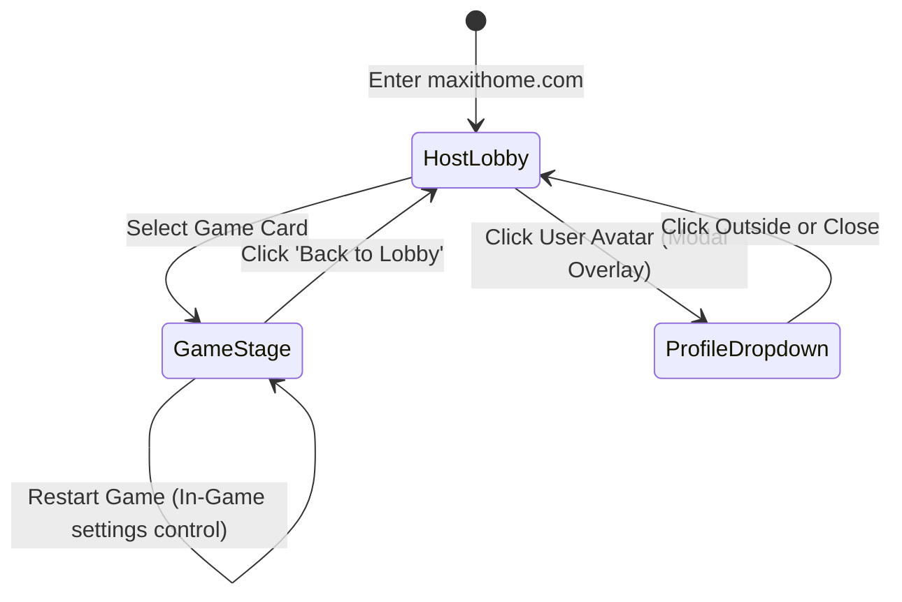

# User Flows: MindFlex

## 1. Overview
MindFlex is the human brain gym designed to resist AI-induced cognitive offloading.

### 1.1 Product Goals
*   Provide immediate, low-barrier cognitive stimulation through HTML5 games.
*   Retain users through habit-forming streaks and visible progress tracking.
*   Position cognitive health in contrast to "AI replacement lines."

### 1.2 Primary User Types
1.  **Modern Knowledge Worker**: Highly analytical, seeks quantified performance tracking.
2.  **Casual Commuter**: Seeks instant-play, short-session games to pass downtime.

### 1.3 Entry Points
*   **Direct URL (`maxithome.com`)**: Navigates directly to the Host Lobby.
*   **Category Deep Link (`maxithome.com/#/memory`)**: Deep-links to filter the lobby to specific cognitive categories.

---

## 2. User Journeys

### 2.1 Journey 1: First-Time Initialization and Practice
*   **User Objective**: Play a quick game and see performance integrated into the cognitive radar chart.
*   **Starting Point**: Browser landing.
*   **Trigger**: User navigates to the root URL.
*   **Sequence & Branching Logic**:
    ```mermaid
    graph TD
        A[Enter maxithome.com] --> B{Anonymous ID exists?}
        B -- No --> C[Generate UUID & Save to LocalStorage]
        B -- Yes --> D[Load Profile & Scores from Backend]
        C --> E[Register via API]
        E --> F[Render Lobby Dashboard with 0-score chart]
        D --> G[Render Lobby Dashboard with historical scores]
        F --> H[Click Game Card: Flash Matrix]
        G --> H
        H --> I[Render Sandbox Game Frame]
        I --> J{Play Game}
        J -- Fail/Quit --> K[Click Back button or Exit Frame]
        J -- Complete --> L[Bridge posts scores via postMessage]
        K --> M[Return to Lobby Dashboard]
        L --> N[Verify Origin & Save Telemetry]
        N --> O[Update Radar Chart dynamically]
        O --> M
    ```
*   **Decision Points**:
    *   *Exit mid-game*: If back/close is selected, game state is discarded; no scores are recorded.
    *   *Complete level*: Session score is dispatched automatically.
*   **Validation Steps**:
    *   Client validates that `anonymous_user_id` matches a valid UUID format.
    *   Host listener checks message sender origin matching `window.location.origin`.
*   **Success Outcome**: User returns to lobby, seeing their aggregate rating increase and the Memory axis on the radar chart grow.
*   **Recovery Flow**: If database connection fails during score submission, save the telemetry payload in `LocalStorage` under `mindflex_pending_scores` and retry on next page reload.

### 2.2 Journey 2: Backup and Recovery Flow
*   **User Objective**: Backup anonymous account to prevent progress loss from browser cleanup or device changes.
*   **Trigger**: User clicks their Avatar to open the Profile dropdown.
*   **Sequence**:
    1.  User clicks **Avatar** in top bar.
    2.  Dropdown expands displaying profile statistics and a **12-Word Recovery Mnemonic** (or unique token text block).
    3.  User clicks **Copy Mnemonic**. Mnemonic copied to clipboard.
    4.  *(Restoring on another device)*: User opens Profile Dropdown, clicks **Import Token**, pastes mnemonic, and clicks **Restore**.
    5.  Platform verifies the token. If valid, local storage is updated, and the page refreshes to load the restored scores.
*   **Error Handling**: If token is invalid, display: `"Invalid Recovery Token. Please verify and try again."`

---

## 3. Screen Navigation Architecture

Navigation is governed by transitions between two primary screens: the **Host Lobby Dashboard** and the **Game Stage Viewport**.



### 3.1 Modal & Overlay Behavior
*   **Profile Dropdown**: Acts as an overlay sheet sliding down from the Top Bar. Clicking outside the overlay dismisses it.
*   **Offline Indicator Banner**: Slides down from the top bar if connection is lost. Remains visible and non-interactive until connection resumes.
